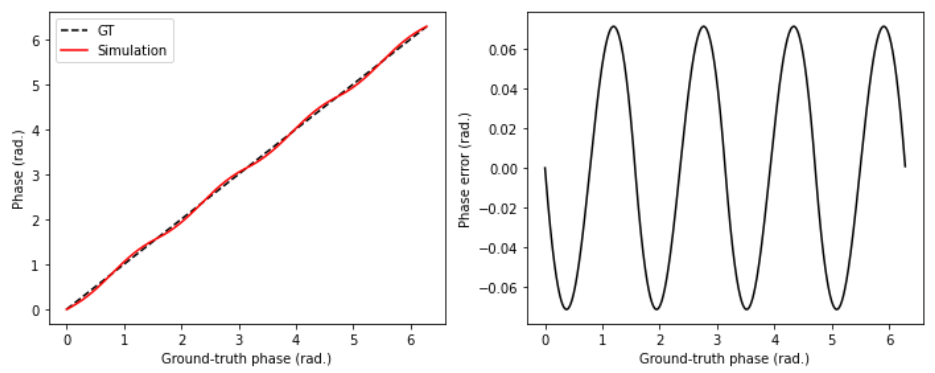

# About this Repository
  
This repository contains a simulator of wiggling phase error of indirect-ToF (time-of-flight) depth camera.  

# Quick Demo
-  [main_notebook.ipynb](https://github.com/ksonod/itof_cyclic_error_simulator/blob/main/main_notebook.ipynb) includes a general simulation and a few examples from academic papers. [[1](https://ieeexplore.ieee.org/document/7391811), [2](https://www.mdpi.com/2304-6732/10/2/170)].
-  Alternatively, you can run [main.py](https://github.com/ksonod/itof_cyclic_error_simulator/blob/main/main.py).
 

# About ToF Cameras
[Time-of-flight (ToF) cameras](https://en.wikipedia.org/wiki/Time-of-flight_camera) are imaging systems that can capture 3D information of the world. These cameras measure the distance to an object by analyzing the flight time of light needed to travel from the camera to the object and back. ToF cameras can be classified into two categories: indirect ToF (**iToF**) and direct ToF (**dToF**). In the case of iToF, periodic signals are generated on the sensor and laser. By evaluating correlation between illumination signal coming back to the sensor (source modulation signal) and sensor signal (sensor demodulation signal), depth information, called phase, is extracted. In iToF, it has been known that phase error (= difference between ground truth phase and measured phase) shows periodic behavior. This error is called **cyclic error, wiggling error, or harmonic aliasing error**. Knowing the characteristics of the cyclic error is important to test actual iToF cameras and make good calibrations. In this repository, an **iToF phase simulator is provided in order to simulate the cyclic error**.

For further detailed and intuitive explanations with visual materials, you can read some articles [[3](https://medium.com/chronoptics-time-of-flight/harmonic-aliasing-wiggle-error-in-indirect-time-of-flight-depth-cameras-efa1632d4d1b), [4](https://thinklucid.com/tech-briefs/sony-depthsense-how-it-works/)].

# Reference
[[1](https://ieeexplore.ieee.org/document/7391811)] V. N. Xuan, W. Weihs, and O. Loffeld, *Illumination, phase step optimization and improvements in simultaneous multiple frequency measurement for Time-of-Flight sensors*, 2015 International Conference on 3D imaging (IC3D), Liege, Belgium, pp. 1-6, 2015   
[[2](https://www.mdpi.com/2304-6732/10/2/170)] Z. Zheng, P. Song, X. Wang, W. Zhang, and Y. Bai, *Wiggling-Related Error Correction Method for Indirect ToF Imaging Systems*, Photonics, 10(2), 170, 2023  
[[3](https://medium.com/chronoptics-time-of-flight/harmonic-aliasing-wiggle-error-in-indirect-time-of-flight-depth-cameras-efa1632d4d1b)] R. Whyte (2020, Sep 17), *Harmonic Aliasing (Wiggle Error) in Indirect Time-of-Flight Depth Cameras*. Medium [Online]. Available: https://medium.com/chronoptics-time-of-flight/harmonic-aliasing-wiggle-error-in-indirect-time-of-flight-depth-cameras-efa1632d4d1b [Accessed: 19 December, 2023].  
[[4](https://thinklucid.com/tech-briefs/sony-depthsense-how-it-works/)] LUCID Vision Labs, *Sony DepthSense 3D Sensor Explained: Better Time of Flight*. thinklucid.com [Online]. Available: https://thinklucid.com/tech-briefs/sony-depthsense-how-it-works/ [Accessed: 19 December, 2023].  
